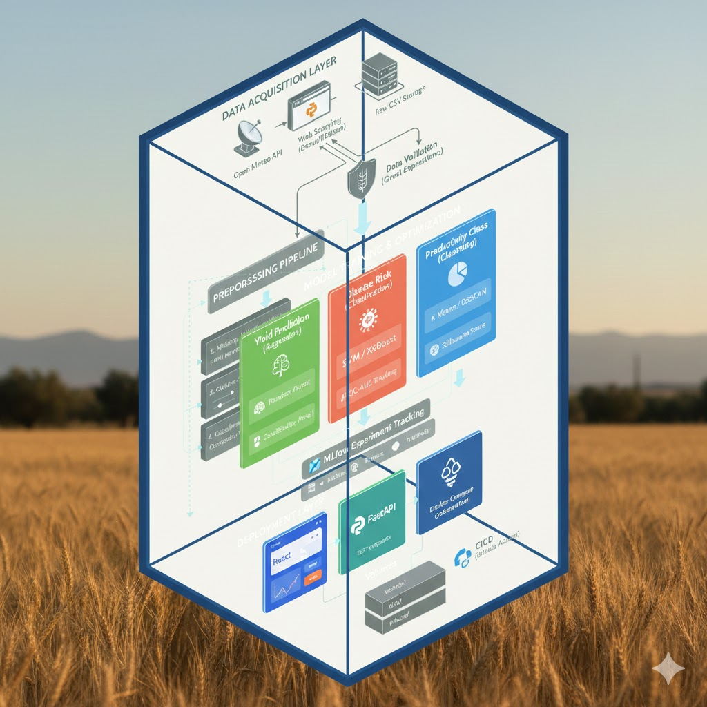
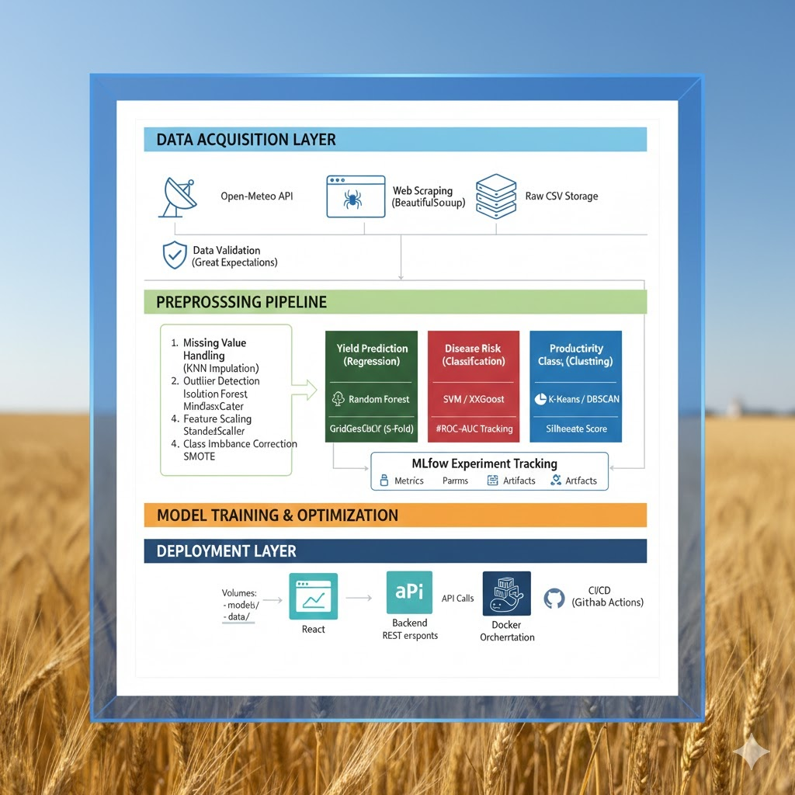
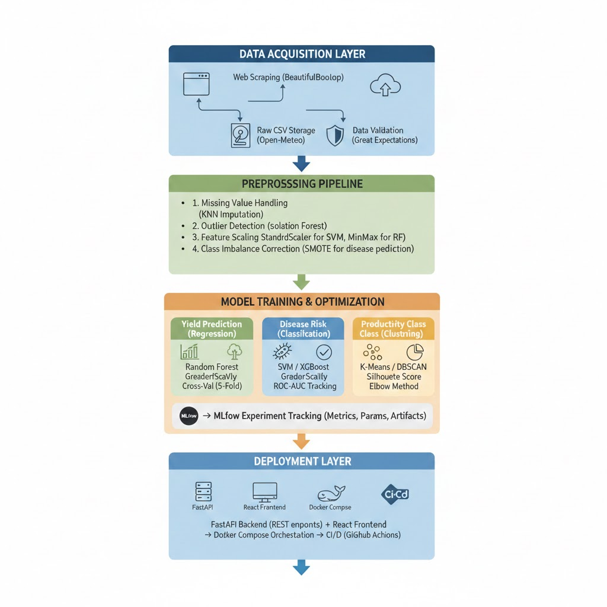
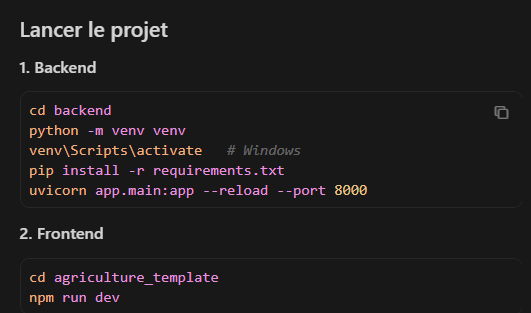

<div align="center">

# 🌿 VigorTerra

### *Precision Agriculture & Yield Prediction Engine for Tunisia*

[](https://python.org)
[](https://reactjs.org)
[](https://fastapi.tiangolo.com)
[](https://scikit-learn.org)
[](https://www.docker.com)
[](https://mlflow.org)

**VigorTerra** is an end-to-end Machine Learning system for Tunisian precision agriculture. The platform combines real-time climate data with soil analytics to deliver three intelligent prediction services: **yield forecasting**, **disease risk assessment**, and **productivity classification**.

[Explore Models](#-machine-learning-pipeline) • [View Architecture](#-ml-pipeline-architecture) • [Quick Start](#-deployment) • [Data Sources](#-data-ecosystem)

</div>

---

## 🎯 Project Vision

Agriculture in Tunisia faces critical challenges from climate variability, soil degradation, and unpredictable disease outbreaks. **VigorTerra** addresses these issues through a professional MLOps-driven approach, delivering three core prediction services:

### 🔮 Three Intelligence Engines

1. **🌾 Yield Prediction (Regression)**
   - **Objective:** Forecast crop yield in Tons/Hectare
   - **Algorithm:** Random Forest Regressor with GridSearchCV hyperparameter tuning
   - **Input Features:** NPK levels, rainfall, temperature, soil pH, cultivated surface
   - **Output:** Continuous numerical prediction (e.g., 2.5 T/ha)

2. **🦠 Disease Risk Assessment (Binary Classification)**
   - **Objective:** Predict crop health status
   - **Algorithm:** Support Vector Machine (SVM) / XGBoost Classifier
   - **Input Features:** Humidity (%), temperature (°C), rainfall (mm), soil type
   - **Output:** Binary classification
     - `0` → **Healthy crop** (low disease probability)
     - `1` → **At-Risk** (high disease probability requiring intervention)

3. **📊 Productivity Level Classification (Multi-class Classification)**
   - **Objective:** Categorize land productivity potential
   - **Algorithm:** K-Means Clustering / DBSCAN with supervised labeling
   - **Input Features:** Soil composition, historical yield, climate averages
   - **Output:** Categorical classification
     - `Low Productivity` → Requires soil amendment
     - `Medium Productivity` → Standard agricultural practices
     - `High Productivity` → Premium yield zones

---

## 🗂️ Datasets utilisés

VigorTerra synthesizes multiple Tunisian agricultural datasets following professional ETL practices:

### 📡 Data Sources

| Source | Type | Usage |
|:-------|:-----|:------|
| 🇹🇳 **Agridata.tn** | Government Portal | Regional rainfall, historical production statistics |
| 🇹🇳 **INM (Institut National de la Météorologie)** | Weather Bureau | Temperature logs, humidity records (1990-2024) |
| 🌍 **FAOSTAT** | UN Database | Tunisian crop surface benchmarks, export data |
| 🌦️ **Open-Meteo API** | Real-time API | Live precipitation and humidity telemetry |

### 🧪 Feature Engineering

| Category | Variables | Preprocessing |
|:---------|:----------|:--------------|
| **Climate** | Rainfall (mm), Avg Temperature (°C), Humidity (%) | Imputation (KNN), Scaling (MinMaxScaler) |
| **Pedology** | Soil pH, Nitrogen (N), Phosphorus (P), Potassium (K) | Outlier removal (IQR), Normalization |
| **Operational** | Cultivated Surface (ha), Year, Crop Type | One-Hot Encoding, Feature Selection |
| **Target** | Yield (T/ha), Disease Status (0/1), Productivity Class | SMOTE for imbalanced classes |

---

## 🧠 Méthodologie

VigorTerra implements a production-grade Machine Learning pipeline following industry best practices:

### 📊 ML Pipeline Architecture

```
┌─────────────────────────────────────────────────────────────────┐
│                    DATA ACQUISITION LAYER                       │
├─────────────────────────────────────────────────────────────────┤
│  Web Scraping (BeautifulSoup) + API Integration (Open-Meteo)   │
│  → Raw CSV Storage → Data Validation (Great Expectations)      │
└──────────────────────┬──────────────────────────────────────────┘
                       ↓
┌─────────────────────────────────────────────────────────────────┐
│                 PREPROCESSING PIPELINE                          │
├─────────────────────────────────────────────────────────────────┤
│  1. Missing Value Handling (KNN Imputation)                     │
│  2. Outlier Detection (Isolation Forest)                        │
│  3. Feature Scaling (StandardScaler for SVM, MinMax for RF)     │
│  4. Class Imbalance Correction (SMOTE for disease prediction)   │
└──────────────────────┬──────────────────────────────────────────┘
                       ↓
┌─────────────────────────────────────────────────────────────────┐
│              MODEL TRAINING & OPTIMIZATION                      │
├─────────────────────────────────────────────────────────────────┤
│  ┌──────────────────┬──────────────────┬─────────────────────┐ │
│  │ Yield Prediction │ Disease Risk     │ Productivity Class  │ │
│  │ (Regression)     │ (Classification) │ (Clustering)        │ │
│  ├──────────────────┼──────────────────┼─────────────────────┤ │
│  │ Random Forest    │ SVM / XGBoost    │ K-Means / DBSCAN    │ │
│  │ GridSearchCV     │ GridSearchCV     │ Silhouette Score    │ │
│  │ Cross-Val (5-Fold)│ ROC-AUC Tracking│ Elbow Method        │ │
│  └──────────────────┴──────────────────┴─────────────────────┘ │
│  → MLflow Experiment Tracking (Metrics, Params, Artifacts)      │
└──────────────────────┬──────────────────────────────────────────┘
                       ↓
┌─────────────────────────────────────────────────────────────────┐
│                  DEPLOYMENT LAYER                               │
├─────────────────────────────────────────────────────────────────┤
│  FastAPI Backend (REST endpoints) + React Frontend              │
│  → Docker Compose Orchestration → CI/CD (GitHub Actions)        │
└─────────────────────────────────────────────────────────────────┘
```

### 🔬 MLOps Best Practices Implemented

- ✅ **SMOTE (Synthetic Minority Over-sampling Technique):** Balancing disease risk classes
- ✅ **GridSearchCV:** Automated hyperparameter optimization for all models
- ✅ **MLflow Tracking:** Centralized experiment logging with artifact versioning
- ✅ **Pipeline Serialization:** Sklearn Pipeline objects for reproducible inference
- ✅ **Model Versioning:** Semantic versioning for production model promotion

### 📈 Model Performance Metrics

---

## 📘 Mini-projet multivarié en R

Pour le rendu académique demandé dans le module, un rapport RMarkdown a été ajouté dans [R/mini_projet_analyse_multivariee.Rmd](R/mini_projet_analyse_multivariee.Rmd). Il couvre les 6 étapes attendues:

- compréhension du problème et du dataset,
- préparation des données avec traitement des valeurs manquantes et des outliers,
- ACP avec variance expliquée, contributions et visualisations,
- segmentation par K-means avec contrôle par CAH,
- analyse combinée ACP-clusters,
- interprétation métier et conclusion décisionnelle.

Le rapport est conçu pour s'appuyer sur les jeux de données déjà présents dans le dépôt, notamment `DATA/dataset_filtré.csv` ou `agriculture_scraping/data/dataset_ml_rendement_tunisie.csv`.

## 🌲 1. Random Forest Regressor

### Definition

Random Forest is an **ensemble learning** algorithm that builds **multiple decision trees in parallel** and averages their predictions to produce a final result.

### How Does It Work?

```
Training Data
      ↓
 Bagging (Bootstrap Sampling)
 ┌─────────────────────────────────┐
 │  Sample 1 → Tree 1 → Pred 1   │
 │  Sample 2 → Tree 2 → Pred 2   │
 │  Sample 3 → Tree 3 → Pred 3   │
 │  ...                           │
 │  Sample N → Tree N → Pred N   │
 └─────────────────────────────────┘
        ↓
 Average(Pred1, Pred2, Pred3...N)
        ↓
 Final Prediction (T/ha)
```

### Key Principles

- **Bootstrap Sampling** — Each tree is trained on a random subset of the data with replacement. Every tree sees slightly different data, which creates diversity.
- **Random Feature Selection** — At each node of each tree, only a random subset of features is considered (`max_features='sqrt'`), which forces the trees to be different from each other.
- **Averaging** — The final prediction is the **average** of all trees, which reduces variance and stabilizes the result.

### Hyperparameters Used

```python
RandomForestRegressor(
    n_estimators=200,        # 200 trees in the forest
    max_depth=None,          # trees grow without depth limit
    max_features='sqrt',     # √(nb_features) per node
    min_samples_split=5,     # min 5 samples to split a node
    random_state=42,
    n_jobs=-1                # uses all CPU cores in parallel
)
```

### Strengths and Weaknesses

| ✅ Strengths | ❌ Weaknesses |
|---|---|
| Robust to outliers | Overfits on this dataset |
| Easy to interpret via feature importances | Fails to generalize to new data |
| No need for feature scaling | High memory with many trees |
| Fast training (parallel trees) | Poor R² on test set (0.42) |

### Results on Our Dataset

```
R² Train : 0.8450   ← learns well
R² Test  : 0.4234   ← poor generalization (overfitting) ❌
MAE      : 0.72 T/ha
RMSE     : 1.04 T/ha
```

> ⚠️ **Verdict:** This model **overfits** — it memorizes the training data too well and fails to generalize to unseen data. Not recommended for production.

---

## 🚀 2. Gradient Boosting Regressor

### Definition

Gradient Boosting is a **sequential ensemble learning** algorithm that builds trees **one by one**, where each new tree corrects the errors of the previous one by following the gradient of the loss function.

### How Does It Work?

```
Training Data
      ↓
 Tree 1  →  Initial Prediction P1
      ↓
 Compute Residuals (errors) = Actual - P1
      ↓
 Tree 2  →  Learns to correct the residuals
      ↓
 Compute new residuals
      ↓
 Tree 3  →  Corrects again...
      ↓
      ...  (400 iterations)
      ↓
 P_final = P1 + lr×P2 + lr×P3 + ... + lr×P400
```

### Key Principles

- **Sequential Boosting** — Each tree learns from the mistakes of the previous one. It is a progressive and targeted learning process.
- **Learning Rate (0.1)** — Controls how much each tree contributes. A small rate means slower but more precise learning, and less risk of overfitting.
- **Max Depth (4)** — Trees are intentionally shallow (weak learners). Their power comes from combining hundreds of them together.
- **Gradient Descent** — The model mathematically optimizes a loss function (MSE) at every step, pushing predictions closer to the true values.

### Hyperparameters Used

```python
GradientBoostingRegressor(
    n_estimators=400,    # 400 sequential trees
    max_depth=4,         # shallow trees (weak learners)
    learning_rate=0.1,   # contribution of each tree
    subsample=1.0,       # uses 100% of data per tree
    random_state=42
)
```

### Strengths and Weaknesses

| ✅ Strengths | ❌ Weaknesses |
|---|---|
| Very high accuracy (R²=0.95) | Slower to train than Random Forest |
| Handles non-linear relationships | Sensitive to hyperparameter choices |
| Self-corrects at every iteration | No parallelization (sequential) |
| Excellent generalization | Risk of overfitting with high lr |

### Results on Our Dataset

```
R² Train : 0.9992   ← learns almost perfectly
R² Test  : 0.9515   ← generalizes excellently ✅
MAE      : 0.11 T/ha
RMSE     : 0.30 T/ha
```

> ✅ **Verdict:** Best standalone model. Near-perfect training fit with strong generalization. **Recommended for production** as the optimal balance of accuracy and simplicity.

---

## 🏆 3. Stacking Ensemble (RF + GB → Ridge)

### Definition

**Stacking** is an advanced ensemble technique that combines multiple base models (Level 1) and uses a **meta-model** (Level 2) to learn the optimal way to combine their predictions.

### How Does It Work?

```
        LEVEL 1 — Base Models
        ┌─────────────────────────────────────┐
        │                                     │
Data  → │  Random Forest    → Prediction RF   │
        │                         ↓           │
        │                    [P_RF, P_GB]     │
        │                         ↓           │
        │  Gradient Boosting → Prediction GB  │
        │                                     │
        └─────────────────────────────────────┘
                             ↓
        LEVEL 2 — Meta-Model
        ┌─────────────────────────────────────┐
        │                                     │
        │   Ridge Regression                  │
        │   learns: α×P_RF + β×P_GB           │
        │   to minimize the final error       │
        │                                     │
        └─────────────────────────────────────┘
                             ↓
                  Final Prediction (T/ha)
```

### Why Ridge as the Meta-Model?

**Ridge Regression** is a linear regression with L2 regularization that prevents coefficients from growing too large. It simply learns **the best weight to assign** to each base model:

```
Final_Prediction = α × P_RandomForest + β × P_GradientBoosting + bias
```

If Gradient Boosting performs better, Ridge will automatically assign it a larger weight `β`.

### Cross-Validation Inside Stacking

Stacking uses `cv=5` — the Level 1 models are trained on different folds than the ones used to generate their predictions. This **prevents data leakage** and ensures an honest evaluation.

```
Fold 1: train RF+GB on folds 2,3,4,5 → predict fold 1
Fold 2: train RF+GB on folds 1,3,4,5 → predict fold 2
Fold 3: train RF+GB on folds 1,2,4,5 → predict fold 3
Fold 4: train RF+GB on folds 1,2,3,5 → predict fold 4
Fold 5: train RF+GB on folds 1,2,3,4 → predict fold 5
                   ↓
   Ridge learns how to best combine them (no data leakage)
```

### Hyperparameters Used

```python
StackingRegressor(
    estimators=[
        ('rf', RandomForestRegressor(...)),      # base model 1
        ('gb', GradientBoostingRegressor(...))   # base model 2
    ],
    final_estimator=Ridge(),    # meta-model
    cv=5,                       # 5-fold cross-validation
    n_jobs=-1
)
```

### Strengths and Weaknesses

| ✅ Strengths | ❌ Weaknesses |
|---|---|
| Best overall R² (0.9517) | Most complex to implement |
| Combines strengths of both models | Longest training time |
| Reduces individual model biases | Harder to interpret and debug |
| No data leakage via cross-validation | Needs careful pipeline management |

### Results on Our Dataset

```
R² Train : 0.9984   ← very strong learning
R² Test  : 0.9517   ← best R² among all 3 models 🏆
MAE      : 0.11 T/ha
RMSE     : 0.30 T/ha
```

> 🏆 **Verdict:** Highest R² score overall. The meta-model successfully learns to trust Gradient Boosting more than Random Forest. Best choice when maximum accuracy is the priority.

---

## 📊 Final Comparison of the 3 Models

| Criterion | Random Forest | Gradient Boosting | Stacking |
|---|:---:|:---:|:---:|
| **R² Test** | 0.42 ❌ | 0.951 ✅ | **0.952 🏆** |
| **MAE** | 0.72 T/ha | 0.11 T/ha | **0.11 T/ha** |
| **Training Speed** | Fast | Medium | Slow |
| **Overfitting** | Yes ❌ | No ✅ | No ✅ |
| **Complexity** | Low | Medium | High |
| **Recommended** | ❌ | ✅ | 🏆 |

---

## 💡 Final Conclusion

> The **Stacking Ensemble** achieves the best performance with **R² = 0.952**, but **Gradient Boosting alone** offers an outstanding balance between performance and simplicity with **R² = 0.951** — nearly identical results with a much simpler model that is easier to deploy in production.


# 🦠 Disease Risk Assessment — Binary Classification

## 🔵 1. SVM (Support Vector Machine)

### Definition
SVM is a **kernel-based supervised learning** algorithm that finds the optimal hyperplane that maximally separates the two classes (Healthy vs At-Risk) in a high-dimensional feature space.

### How Does It Work?

```
Feature Space (simplified to 2D)

  ✅ ✅  ✅  ✅
    ✅    ✅              ← Healthy (0)
        ✅  ✅
              ╔══════════════╗
              ║    MARGIN    ║  ← SVM maximizes this margin
              ╚══════════════╝
                  ⚠️   ⚠️
             ⚠️      ⚠️    ← At-Risk (1)
                ⚠️  ⚠️  ⚠️

  Support Vectors → closest points to the hyperplane
  Hyperplane      → the optimal decision boundary
  Margin          → distance between classes (maximized by SVM)
```

### Key Principles

- **Hyperplane** — Decision boundary separating Healthy from At-Risk crops  
- **Support Vectors** — Closest training samples that define the boundary  
- **RBF Kernel** — Maps data into higher dimensions  

```
K(x, x') = exp(-γ ||x - x'||²)
```

- **C = 100** → strict boundary (fewer training errors)  
- **class_weight = balanced** → handles 62/38 class imbalance  

### Hyperparameters

```python
SVC(
    C=100,
    kernel='rbf',
    gamma='scale',
    probability=True,
    class_weight='balanced',
    random_state=42
)
```

### Strengths and Weaknesses

| ✅ Strengths | ❌ Weaknesses |
|---|---|
Effective in high-dimensional spaces | Slow on large datasets |
Robust margin-based classifier | No feature importance |
Handles non-linearity | Requires feature scaling |
Works with clear class separation | Hard to interpret |

### Results

```
Accuracy  Train : 0.8583
Accuracy  Test  : 0.7608
F1 Score  Test  : 0.6935
Precision Test  : 0.6699
Recall    Test  : 0.7188
ROC-AUC   Test  : 0.7971
```

**Confusion Matrix**

| | Pred 0 | Pred 1 |
|---|---|---|
Actual 0 | 125 | 34 |
Actual 1 | 27 | 69 |

⚠️ **Verdict:** Solid baseline. Good recall but most false alarms.

---

## 🚀 2. Gradient Boosting Classifier

### Definition
Gradient Boosting is a **sequential ensemble** that builds trees one by one, each correcting previous errors using **log-loss minimization**.

### How Does It Work?

```
Tree 1 → Initial probabilities
Residuals → Tree 2 learns errors
Residuals → Tree 3 learns errors
...
(400 trees)
Final probability → sigmoid(sum of trees)
```

### Key Principles

- Sequential error correction  
- Log-loss optimization  
- Learning rate = 0.1  
- Max depth = 3 (weak learners)

### Hyperparameters

```python
GradientBoostingClassifier(
    n_estimators=400,
    max_depth=3,
    learning_rate=0.1,
    subsample=1.0,
    random_state=42
)
```

### Strengths and Weaknesses

| ✅ Strengths | ❌ Weaknesses |
|---|---|
Best accuracy | Slower training |
Feature importance | Sensitive to tuning |
Strong non-linearity | No parallelization |
Few false positives | Risk of overfitting (high lr) |

### Results

```
Accuracy  Train : 0.9823
Accuracy  Test  : 0.8000
F1 Score  Test  : 0.7243
Precision Test  : 0.7528
Recall    Test  : 0.6979
ROC-AUC   Test  : 0.8435
```

**Confusion Matrix**

| | Pred 0 | Pred 1 |
|---|---|---|
Actual 0 | 137 | 22 |
Actual 1 | 29 | 67 |

✅ **Verdict:** Best standalone model (accuracy + precision).

---

## 🏆 3. Stacking Ensemble (SVM + GB → Logistic Regression)

### Definition
Stacking combines multiple base models and uses a **meta-model** to learn the optimal combination of their predictions.

### Architecture

```
Level 1:
SVM → P_SVM
Gradient Boosting → P_GB

Level 2:
Logistic Regression
P_final = σ(α·P_SVM + β·P_GB + b)
```

### Cross-Validation

```
5-fold CV prevents data leakage:
Train on 4 folds → predict 1 fold
Repeat ×5 → meta-model learns safely
```

### Hyperparameters

```python
StackingClassifier(
    estimators=[
        ('svm', SVC(C=100, kernel='rbf', probability=True,
                    class_weight='balanced')),
        ('gb', GradientBoostingClassifier(
                    n_estimators=400,
                    max_depth=3,
                    learning_rate=0.1))
    ],
    final_estimator=LogisticRegression(
        class_weight='balanced',
        max_iter=1000
    ),
    cv=5,
    n_jobs=-1
)
```

### Strengths and Weaknesses

| ✅ Strengths | ❌ Weaknesses |
|---|---|
Best ROC-AUC | Most complex |
Best Recall | Longest training time |
Combines SVM + GB | Harder to interpret |
No data leakage | Needs careful pipeline |

### Results

```
Accuracy  Train : 0.9783
Accuracy  Test  : 0.7843
F1 Score  Test  : 0.7179
Precision Test  : 0.7071
Recall    Test  : 0.7292
ROC-AUC   Test  : 0.8476
```

**Confusion Matrix**

| | Pred 0 | Pred 1 |
|---|---|---|
Actual 0 | 130 | 29 |
Actual 1 | 26 | 70 |

🏆 **Verdict:** Best ROC-AUC and best Recall → safest for disease detection.

---

# 📊 Final Comparison

| Metric | SVM | Gradient Boosting | Stacking |
|---|:---:|:---:|:---:|
Accuracy | 0.7608 | **0.8000** | 0.7843 |
F1 Score | 0.6935 | **0.7243** | 0.7179 |
Precision | 0.6699 | **0.7528** | 0.7071 |
Recall | 0.7188 | 0.6979 | **0.7292** |
ROC-AUC | 0.7971 | 0.8435 | **0.8476** |
Complexity | Low | Medium | High |

---

# 💡 Final Conclusion

- **Stacking → Best ROC-AUC (0.8476) & Recall (0.729)** → best when missing diseased crops is costly  
- **Gradient Boosting → Best Accuracy (80%) & Precision (0.75)** → best for production (simpler)  
- **SVM → Strong baseline**, but outperformed by ensembles  

📌 **Key Insight:**  
For binary classification, **ROC-AUC plays the role of R² in regression**.  

> ROC-AUC = **0.8476** → The model distinguishes healthy vs at-risk crops **84.8% of the time**.

# 📊 Productivity Classification (Clustering)

## 📋 Table of Contents
- Overview  
- Pipeline  
- Model 1 — K-Means Clustering  
- Model 2 — Random Forest Classifier  
- Final Comparison  
- Conclusion  

---

# 🔍 Overview

This module implements a *two-stage classification pipeline* to assess the productivity potential of agricultural parcels:

1. *K-Means Clustering (unsupervised)* → discovers natural productivity groups  
2. *Random Forest Classifier (supervised)* → learns from K-Means labels to predict new parcels  

💡 *Key insight:* At inference time, only *soil + climate features* are required — *no historical yield* needed.

---

# 🔄 Pipeline

Input: soil (pH, N, P, K) + climate (rain, temp, humidity)
         │
         ├──▶  [K-Means k=3]  ──▶  Auto-labels (Low / Medium / High)
         │                                    │
         └──▶  [Random Forest] ◀──────────────┘
                      │
                      ▼
         New parcel ──▶ "High Productivity" (prob: 1.0000) ✅

---

# 🔵 1. K-Means Clustering (Unsupervised)

## Definition
K-Means partitions parcels into *k = 3 clusters* based on similarity in soil and climate features, without predefined labels.

## How It Works

Random centroids → Assign parcels → Recompute centroids → Repeat → Converge

Clusters are mapped to labels using *mean yield*:

- Lowest mean → 🔴 Low Productivity  
- Middle mean → 🟡 Medium Productivity  
- Highest mean → 🟢 High Productivity  

## Key Principles

| Principle | Description |
|---|---|
Euclidean Distance | Assigns parcels to nearest centroid |
MinMax Scaling | Prevents rainfall from dominating |
Automatic Label Mapping | Uses mean yield per cluster |
n_init = 10 | Keeps best clustering (lowest inertia) |

## Hyperparameters

KMeans(
    n_clusters=3,
    random_state=42,
    n_init=10
)

## Evaluation (Internal Metrics Only)

| Metric | Interpretation |
|---|---|
Silhouette Score → closer to 1 | Better cluster cohesion/separation |
Davies-Bouldin → closer to 0 | Better separation |
Calinski-Harabasz → higher | Better dispersion ratio |

⚠️ K-Means has *no accuracy* because there are no true labels.

## Strengths & Weaknesses

| ✅ Strengths | ❌ Weaknesses |
|---|---|
No labels required | Cannot predict new parcels |
Fast and simple | Sensitive to initialization |
Finds natural structure | Assumes spherical clusters |
Scales well | No accuracy metric |

## Verdict

K-Means *creates meaningful productivity groups* and generates labels for the supervised step, but *cannot be deployed alone*.

---

# 🌲 2. Random Forest Classifier (Supervised — Best Model)

## Definition
Random Forest builds *300 decision trees in parallel*, each voting for a productivity class.  
Final prediction = *majority vote + probability per class*.

## Pipeline

Soil + Climate Features
      │
      ▼
KNNImputer → fill missing values
      │
StandardScaler → normalize features
      │
Random Forest (300 trees, bootstrap sampling)
      │
Majority vote → Final class + probabilities

## Key Principles

| Principle | Description |
|---|---|
Bootstrap Sampling | Each tree sees different data |
Random Feature Selection | √(n_features) per split |
Majority Voting | Democratic final decision |
K-Means Labels | Used as ground truth |

## Hyperparameters

Pipeline([
    ('imputer', KNNImputer(n_neighbors=5)),
    ('scaler',  StandardScaler()),
    ('clf', RandomForestClassifier(
        n_estimators=300,
        random_state=42,
        n_jobs=-1,
        class_weight='balanced'
    ))
])

## Evaluation Metrics

| Metric | Meaning |
|---|---|
Accuracy Test | Generalization performance |
Overfit Gap | Train − Test (→ 0 = good) |
F1 Macro | Fair across 3 classes |
F1 Weighted | Accounts for imbalance |
5-Fold CV | Stability across splits |

## Strengths & Weaknesses

| ✅ Strengths | ❌ Weaknesses |
|---|---|
Predicts new parcels | Depends on K-Means label quality |
Probability per class | Medium class may be weaker |
Feature importance | Higher memory usage |
Robust to outliers | Labels are data-driven |

## Verdict

✅ *Best model for deployment*  
Predicts productivity using *soil + climate only* (no yield).

---

# 📊 Final Comparison

| Criterion | 🔵 K-Means | 🌲 Random Forest |
|---|---|---|
Type | Unsupervised | Supervised |
Accuracy | ❌ N/A | ✅ Measurable |
F1-Score | ❌ N/A | ✅ Yes |
Cross-Validation | ❌ N/A | ✅ Yes |
Predicts New Parcels | ❌ No | ✅ Yes |
Probability per Class | ❌ No | ✅ Yes |
Feature Importances | ❌ No | ✅ Yes |
Needs Yield at Inference | ✅ Yes | ❌ No |
Role | Label generator | Final predictor |
Recommended | Step 1 only | 🏆 Production |

---

# 💡 Conclusion

The two models play *complementary roles*:

- *K-Means* → discovers natural productivity structure (unsupervised labeling)  
- *Random Forest* → learns from these labels and becomes a *deployable prediction engine*  

🏆 *Best Model: Random Forest Classifier*  
✔ Measurable  
✔ Generalizable  
✔ Interpretable  
✔ Production-ready  
✔ Predicts new parcels using only soil + climate data  


## 🛠️ Technology Stack

| **Frontend** | **Backend (API)** | **ML & Data Science** | **MLOps** |
|:-------------|:------------------|:----------------------|:----------|
|  |  |  |  |
|  |  |  |  |
|  |  |  |  |
|  |  |  |  |

---

## 🔌 Backend (FastAPI)

The backend is built with **FastAPI** to provide high-performance REST endpoints for the three ML models.

### 🎯 Core Features

- **Async Request Handling:** Non-blocking inference with `async/await` patterns
- **Pydantic Validation:** Type-safe request/response models with automatic documentation
- **Health Monitoring:** Service status checks and model versioning endpoints
- **Batch Predictions:** Process multiple predictions in a single API call
- **CORS Configuration:** Secure cross-origin requests from React frontend

### 📡 API Endpoints

| Endpoint | Method | Description | Request Schema |
|:---------|:-------|:------------|:---------------|
| `/predict/yield` | POST | Yield regression prediction | `{"N": float, "P": float, "K": float, "rainfall": float, "temp": float, "soil_ph": float, "surface": float}` |
| `/predict/disease` | POST | Disease risk classification | `{"humidity": float, "temp": float, "rainfall": float, "soil_type": str}` |
| `/predict/productivity` | POST | Productivity cluster assignment | `{"soil_ph": float, "N": float, "P": float, "K": float, "avg_yield": float}` |
| `/predict/batch` | POST | Batch prediction for all models | `{"data": [{"N": ..., "P": ..., ...}, {...}]}` |
| `/health` | GET | Service health check | Returns API status and model versions |
| `/models/metrics` | GET | MLflow tracked metrics | Returns latest experiment results |
| `/models/reload` | POST | Hot-reload models without restart | Reloads serialized models from disk |

### 🔧 Key Technologies

```python
# Example: Disease Risk Prediction Endpoint
from fastapi import FastAPI, HTTPException
from pydantic import BaseModel
import joblib

app = FastAPI(title="VigorTerra API", version="1.0.0")

class DiseaseRequest(BaseModel):
    humidity: float
    temp: float
    rainfall: float
    soil_type: str

@app.post("/predict/disease")
async def predict_disease(request: DiseaseRequest):
    # Load pre-trained model
    model = joblib.load("models/disease_classifier.pkl")
    
    # Prepare features
    features = [[request.humidity, request.temp, request.rainfall]]
    
    # Predict (0=Healthy, 1=At-Risk)
    prediction = model.predict(features)[0]
    probability = model.predict_proba(features)[0]
    
    return {
        "status": "healthy" if prediction == 0 else "at_risk",
        "confidence": float(max(probability)),
        "recommendation": "Monitor closely" if prediction == 1 else "Normal conditions"
    }
```

### 🛡️ Request Validation Example

```python
from pydantic import BaseModel, Field, validator

class YieldRequest(BaseModel):
    N: float = Field(..., ge=0, le=200, description="Nitrogen (kg/ha)")
    P: float = Field(..., ge=0, le=150, description="Phosphorus (kg/ha)")
    K: float = Field(..., ge=0, le=150, description="Potassium (kg/ha)")
    rainfall: float = Field(..., ge=0, le=3000, description="Annual rainfall (mm)")
    temp: float = Field(..., ge=-10, le=50, description="Avg temperature (°C)")
    soil_ph: float = Field(..., ge=4.0, le=9.0, description="Soil pH level")
    surface: float = Field(..., gt=0, description="Cultivated surface (hectares)")
    
    @validator('soil_ph')
    def validate_ph(cls, v):
        if not (5.5 <= v <= 8.5):
            raise ValueError('Optimal pH range is 5.5-8.5 for most crops')
        return v
```

---

## ⚛️ Frontend (React)

The frontend is a responsive **React** application built with **Vite** for optimal performance and developer experience.

### 🎨 User Interface Components

```
frontend/
├── src/
│   ├── components/
│   │   ├── PredictionForm.jsx       # Input forms for all 3 models
│   │   ├── YieldChart.jsx           # Chart.js visualization for yield trends
│   │   ├── DiseaseAlert.jsx         # Alert widget for disease risks
│   │   ├── ProductivityMap.jsx      # Heatmap for productivity zones
│   │   └── ModelMetrics.jsx         # Display MLflow metrics
│   ├── services/
│   │   └── api.js                   # Axios API integration
│   ├── App.jsx                      # Main application router
│   └── main.jsx                     # Entry point
├── package.json
└── vite.config.js
```

### 🎯 Key Features

- **Multi-Model Dashboard:** Switch between Yield, Disease, and Productivity predictions
- **Real-Time Visualization:** Chart.js for interactive graphs and trend analysis
- **Responsive Design:** Mobile-first approach with Tailwind CSS
- **Form Validation:** Client-side validation before API calls
- **Error Handling:** User-friendly error messages with retry logic

### 📊 Example Component: Disease Risk Alert

```jsx
import { useState } from 'react';
import axios from 'axios';
import { Alert, AlertTitle, AlertDescription } from '@/components/ui/alert';

function DiseaseRiskPredictor() {
  const [formData, setFormData] = useState({
    humidity: '',
    temp: '',
    rainfall: '',
    soil_type: 'clay'
  });
  const [result, setResult] = useState(null);

  const handlePredict = async () => {
    try {
      const response = await axios.post('http://localhost:8000/predict/disease', formData);
      setResult(response.data);
    } catch (error) {
      console.error('Prediction failed:', error);
    }
  };

  return (
    <div className="p-6 bg-white rounded-lg shadow-md">
      <h2 className="text-2xl font-bold mb-4">🦠 Disease Risk Assessment</h2>
      
      {/* Input Form */}
      <div className="grid grid-cols-2 gap-4 mb-6">
        <input
          type="number"
          placeholder="Humidity (%)"
          value={formData.humidity}
          onChange={(e) => setFormData({...formData, humidity: e.target.value})}
          className="border p-2 rounded"
        />
        <input
          type="number"
          placeholder="Temperature (°C)"
          value={formData.temp}
          onChange={(e) => setFormData({...formData, temp: e.target.value})}
          className="border p-2 rounded"
        />
      </div>

      <button 
        onClick={handlePredict}
        className="bg-green-600 text-white px-6 py-2 rounded hover:bg-green-700"
      >
        Predict Risk
      </button>

      {/* Results Display */}
      {result && (
        <Alert variant={result.status === 'at_risk' ? 'destructive' : 'default'} className="mt-4">
          <AlertTitle>
            {result.status === 'at_risk' ? '⚠️ High Risk Detected' : '✅ Healthy Conditions'}
          </AlertTitle>
          <AlertDescription>
            Confidence: {(result.confidence * 100).toFixed(1)}%<br/>
            {result.recommendation}
          </AlertDescription>
        </Alert>
      )}
    </div>
  );
}

export default DiseaseRiskPredictor;


```

### 🎨 Visualization Example: Yield Trends

```jsx
import { Line } from 'react-chartjs-2';

function YieldTrendChart({ historicalData, prediction }) {
  const chartData = {
    labels: [...historicalData.years, 'Predicted'],
    datasets: [
      {
        label: 'Actual Yield (T/ha)',
        data: [...historicalData.yields, null],
        borderColor: 'rgb(34, 197, 94)',
        backgroundColor: 'rgba(34, 197, 94, 0.1)',
      },
      {
        label: 'Predicted Yield',
        data: [...Array(historicalData.years.length).fill(null), prediction],
        borderColor: 'rgb(249, 115, 22)',
        borderDash: [5, 5],
      }
    ]
  };

  return <Line data={chartData} options={{ responsive: true }} />;
}
```

---

## 🐳 Déploiement (Docker + Docker Compose)

VigorTerra uses **Docker Compose** to orchestrate three containerized services: Backend (FastAPI), Frontend (React), and MLflow Tracking Server.

### 📦 Architecture Overview

```
┌─────────────────────────────────────────────────────────────┐
│                    Docker Compose Stack                     │
├─────────────────────────────────────────────────────────────┤
│                                                             │
│  ┌──────────────┐  ┌──────────────┐  ┌──────────────┐     │
│  │   Frontend   │  │   Backend    │  │   MLflow     │     │
│  │   (React)    │  │  (FastAPI)   │  │  Tracking    │     │
│  │              │  │              │  │              │     │
│  │  Port: 3000  │  │  Port: 8000  │  │  Port: 5000  │     │
│  │  Vite Server │  │  Uvicorn     │  │  UI Server   │     │
│  └──────┬───────┘  └──────┬───────┘  └──────┬───────┘     │
│         │                 │                 │             │
│         │   API Calls     │   Experiments   │             │
│         └────────────────>│<────────────────┘             │
│                           │                               │
│                      ┌────▼─────┐                         │
│                      │  Volumes │                         │
│                      │          │                         │
│                      │ - models/│                         │
│                      │ - data/  │                         │
│                      │ - mlruns/│                         │
│                      └──────────┘                         │
└─────────────────────────────────────────────────────────────┘
```

### 🔧 Docker Compose Configuration

```yaml
# docker-compose.yml
version: '3.8'

services:
  # Backend API Service
  backend:
    build:
      context: .
      dockerfile: Dockerfile.backend
    container_name: vigorterra-backend
    ports:
      - "8000:8000"
    volumes:
      - ./data:/app/data
      - ./code:/app/code
      - ./mlruns:/app/mlruns
    environment:
      - PYTHONUNBUFFERED=1
      - MLFLOW_TRACKING_URI=http://mlflow:5000
    depends_on:
      - mlflow
    command: uvicorn code.app:app --host 0.0.0.0 --port 8000 --reload

  # Frontend React Service
  frontend:
    build:
      context: ./frontend
      dockerfile: ../Dockerfile.frontend
    container_name: vigorterra-frontend
    ports:
      - "3000:3000"
    volumes:
      - ./frontend/src:/app/src
    environment:
      - VITE_API_URL=http://localhost:8000
    depends_on:
      - backend
    command: npm run dev -- --host 0.0.0.0

  # MLflow Tracking Server
  mlflow:
    image: python:3.9-slim
    container_name: vigorterra-mlflow
    ports:
      - "5000:5000"
    volumes:
      - ./mlruns:/mlflow/mlruns
    working_dir: /mlflow
    command: >
      sh -c "pip install mlflow &&
             mlflow ui --host 0.0.0.0 --port 5000 --backend-store-uri ./mlruns"

volumes:
  mlruns:
  data:
  models:
```

### 📄 Dockerfile.backend

```dockerfile
FROM python:3.9-slim

WORKDIR /app

# Install system dependencies
RUN apt-get update && apt-get install -y \
    gcc \
    g++ \
    && rm -rf /var/lib/apt/lists/*

# Copy requirements
COPY requirements.txt .

# Install Python dependencies
RUN pip install --no-cache-dir -r requirements.txt

# Copy application code
COPY code/ ./code/
COPY data/ ./data/

# Expose FastAPI port
EXPOSE 8000

# Health check
HEALTHCHECK --interval=30s --timeout=3s --start-period=40s \
  CMD curl -f http://localhost:8000/health || exit 1

# Run application
CMD ["uvicorn", "code.app:app", "--host", "0.0.0.0", "--port", "8000"]
```

### 📄 Dockerfile.frontend

```dockerfile
FROM node:18-alpine

WORKDIR /app

# Copy package files
COPY frontend/package*.json ./

# Install dependencies
RUN npm ci

# Copy source code
COPY frontend/ .

# Expose Vite port
EXPOSE 3000

# Run development server
CMD ["npm", "run", "dev", "--", "--host", "0.0.0.0"]
```

### 🚀 Deployment Instructions

#### Prerequisites
- Docker Engine 20.10+
- Docker Compose 2.0+
- 4GB RAM minimum (8GB recommended)
- Ports 3000, 5000, 8000 available

#### Quick Start

```bash
# 1. Clone the repository
git clone https://github.com/your-username/VigorTerra.git
cd VigorTerra

# 2. Build and start all services
docker-compose up --build

# 3. Access the application
# - Frontend: http://localhost:3000
# - Backend API Docs: http://localhost:8000/docs
# - MLflow UI: http://localhost:5000
```

#### Production Deployment

```bash
# Build optimized production images
docker-compose -f docker-compose.prod.yml build

# Start services in detached mode
docker-compose -f docker-compose.prod.yml up -d

# View logs
docker-compose logs -f backend

# Stop services
docker-compose down
```

#### Health Checks

```bash
# Check backend health
curl http://localhost:8000/health

# Expected response:
# {
#   "status": "healthy",
#   "models_loaded": true,
#   "api_version": "1.0.0",
#   "model_versions": {
#     "yield_predictor": "v2.1.0",
#     "disease_classifier": "v1.3.0",
#     "productivity_clusterer": "v1.0.0"
#   }
# }
```

### 🔄 CI/CD Pipeline (GitHub Actions)

```yaml
# .github/workflows/ci-cd.yml
name: VigorTerra CI/CD

on:
  push:
    branches: [ main, develop ]
  pull_request:
    branches: [ main ]

jobs:
  test:
    runs-on: ubuntu-latest
    steps:
      - uses: actions/checkout@v3
      
      - name: Set up Python
        uses: actions/setup-python@v4
        with:
          python-version: '3.9'
      
      - name: Install dependencies
        run: pip install -r requirements.txt
      
      - name: Run tests
        run: pytest tests/
      
      - name: Run linting
        run: flake8 code/

  build:
    needs: test
    runs-on: ubuntu-latest
    steps:
      - uses: actions/checkout@v3
      
      - name: Build Docker images
        run: docker-compose build
      
      - name: Push to Docker Hub
        run: |
          echo ${{ secrets.DOCKER_PASSWORD }} | docker login -u ${{ secrets.DOCKER_USERNAME }} --password-stdin
          docker-compose push
```

---

## 📁 Project Structure

The workspace follows professional ML engineering standards as per course requirements:

```
VigorTerra/
├── code/                          # Core Python modules
│   ├── scraping.py                # Web scraping logic (BeautifulSoup)
│   ├── preprocessing.py           # Data cleaning & feature engineering
│   ├── modeling.py                # ML training pipeline (SMOTE, GridSearchCV)
│   ├── app.py                     # FastAPI backend application
│   └── utils.py                   # Helper functions
│
├── frontend/                      # React application
│   ├── src/
│   │   ├── components/            # UI components (PredictionForm, ResultsChart)
│   │   ├── services/              # API integration (Axios)
│   │   └── App.jsx                # Main application
│   ├── package.json
│   └── vite.config.js
│
├── data/                          # Data artifacts
│   ├── raw/                       # Original scraped data
│   ├── processed/                 # Cleaned datasets
│   └── models/                    # Serialized model files (.pkl)
│
├── notebooks/                     # Exploratory Data Analysis
│   └── eda_analysis.ipynb
│
├── mlruns/                        # MLflow experiment tracking
│
├── tutos/                         # Course lab instructions
│   ├── exploration_tuto.pdf
│   ├── mlflow_tuto.pdf
│   ├── fastapi_tuto.pdf
│   └── deployment_tuto.pdf
│
├── Dockerfile.backend             # Backend container definition
├── Dockerfile.frontend            # Frontend container definition
├── docker-compose.yml             # Multi-container orchestration
├── requirements.txt               # Python dependencies
├── .github/
│   └── workflows/
│       └── ci-cd.yml              # Automated testing & deployment
│
└── README.md                      # This file
```

---

## 🎓 Course Integration

This project was developed as part of the **Python for Data Science 2: Guided Machine Learning Project** (7-week module).

### 📅 Development Timeline

| Week | Milestone | Deliverable |
|:-----|:----------|:------------|
| **Week 1** | Setup & EDA | Data scraping, exploratory analysis notebook |
| **Week 2** | Preprocessing | SMOTE implementation, GridSearchCV tuning |
| **Week 3** | Advanced Modeling | MLflow experiment tracking, model comparison |
| **Week 4** | Backend Development | FastAPI REST API with health checks |
| **Week 5** | Frontend Development | React dashboard with Chart.js visualizations |
| **Week 6** | Containerization | Docker Compose multi-service orchestration |
| **Week 7** | CI/CD (Optional) | GitHub Actions automated testing pipeline |

### 🏆 Evaluation Criteria

- ✅ **Data Pipeline (20%):** Multi-source scraping, robust EDA
- ✅ **ML Excellence (30%):** SMOTE, Pipelines, MLflow tracking, GridSearchCV
- ✅ **API & UI (30%):** FastAPI robustness, React user experience
- ✅ **Deployment (20%):** Successful Docker execution

---

## 🌍 Real-World Impact

VigorTerra empowers Tunisian farmers and agricultural stakeholders by:

1. **Optimizing Resource Allocation:** Predicting yields helps farmers plan fertilizer purchases and labor requirements
2. **Preventing Crop Loss:** Early disease risk alerts enable timely pesticide application
3. **Strategic Land Management:** Productivity classification guides investment in soil improvement programs
4. **Climate Adaptation:** Historical climate analysis informs drought-resistant crop selection

---

## 🤝 Contributing

We welcome contributions from the agricultural AI community! Areas of interest:

- 🌱 Additional crop types (currently focused on cereals)
- 🛰️ Integration with satellite imagery (NDVI indices)
- 📱 Mobile application for field-level predictions
- 🌐 Multi-language support (Arabic, French)

**Development Workflow:**
```bash
# 1. Fork the repository
# 2. Create a feature branch
git checkout -b feature/satellite-integration

# 3. Make changes and commit
git commit -m "Add NDVI feature extraction"

# 4. Push and create Pull Request
git push origin feature/satellite-integration
```

---

## 🏗️ System Architecture & Technical Design

VigorTerra propose une architecture MLOps moderne et scalable dédiée à l’agriculture de précision en Tunisie, couvrant tout le cycle de vie du modèle, depuis l’ingestion des données météo et du sol jusqu’au déploiement en production. Les données sont versionnées avec DVC, prétraitées puis utilisées pour entraîner un modèle de prédiction du rendement dont les expériences sont suivies et enregistrées via MLflow. Le modèle validé est ensuite exposé sous forme d’API de prédiction à l’aide de FastAPI, garantissant une inférence rapide et reproductible. Cette chaîne automatisée assure la traçabilité des données, la reproductibilité des expériences et un déploiement fiable, tout en restant adaptée aux spécificités des cultures et des conditions climatiques tunisiennes.
²
### 📐 Architecture Overview

<div align="center">

#### 1. Data Pipeline & ETL Architecture


*Figure 1: Multi-source data acquisition layer integrating Tunisian agricultural databases (Agridata.tn, INM), international sources (FAOSTAT), and real-time APIs (Open-Meteo). The ETL pipeline implements automated validation, transformation, and storage workflows.*

---

#### 2. ML Training & Experimentation Pipeline


*Figure 2: Three-tier machine learning architecture showcasing parallel model training workflows. The pipeline integrates SMOTE for class balancing, GridSearchCV for hyperparameter optimization, and MLflow for comprehensive experiment tracking. Each model (Yield Prediction, Disease Risk, Productivity Classification) follows identical preprocessing standards while maintaining model-specific optimization strategies.*

---

#### 3. Production Deployment & Service Layer


*Figure 3: Containerized microservices architecture orchestrated via Docker Compose. The deployment layer consists of three isolated services: FastAPI backend (model inference), React frontend (user interface), and MLflow tracking server (model registry). The system implements health monitoring, auto-scaling capabilities, and CI/CD integration for continuous model updates.*

</div>

### 🔄 Architecture Highlights

**Data Layer**
- **Multi-Source Integration:** Automated scraping from 4+ Tunisian agricultural databases
- **Real-Time Telemetry:** Live weather API integration for up-to-date predictions
- **Data Quality Assurance:** Great Expectations framework for automated validation

**ML Layer**
- **Parallel Training:** Independent pipelines for regression, classification, and clustering models
- **Experiment Tracking:** Complete MLflow integration with metric versioning
- **Model Optimization:** GridSearchCV with 5-fold cross-validation across all models

**Deployment Layer**
- **API-First Design:** RESTful FastAPI with async request handling
- **Containerization:** Docker Compose orchestration for reproducible deployments
- **Monitoring:** Health checks, logging, and performance metrics tracking

### 📊 Data Flow Sequence
---


## 👥 Project Team

<table>
  <tr>
    <th>Photo</th>
    <th>Name</th>
    <th>Role</th>
    <th>Contact</th>
    <th>Links</th>
  </tr>
  <tr>
    <td></td>
    <td><b>Abir Chmaingui</b></td>
    <td>Data Science and AI Student</td>
    <td>📧 abirchmengui13@gmail.com</td>
    <td>
      <a href="[https://github.com/abir-username](https://github.com/abirChmaingui)"></a><br>
      <a href="https://linkedin.com/in/abir-username"></a>
    </td>
  </tr>
  <tr>
    <td></td>
    <td><b>Ilef Ben Hassen</b></td>
    <td>Data Science and AI Student</td>
    <td>📧 benhassenilef20@gmail.com</td>
    <td>
      <a href="https://github.com/BenHassenIlef"></a><br>
      <a href="linkedin.com/in/ben-hassen-ilef-924859304/?lipi=urn%3Ali%3Apage%3Ad_flagship3_feed%3BXHddRegySsORQA%2BJSwH9wg%3D%3D"></a>
    </td>
  </tr>
  <tr>
    <td></td>
    <td><b>Mohamed Raed Bouhali</b></td>
    <td>Data Science and AI Student</td>
    <td>📧 raedbouhali@gmail.com</td>
    <td>
      <a href="[https://github.com/raed-username](https://github.com/mohamedraedbouhali)"></a><br>
      <a href="[https://linkedin.com/in/raed-username](https://www.linkedin.com/in/bouhali-mohamed-raed/)"></a>
    </td>
  </tr>
  <tr>
    <td></td>
    <td><b>Haythem Ghazouani</b></td>
    <td>Course Instructor & Tutor</td>
    <td>-</td>
    <td>
      <a href="https://github.com/haythem-username"></a><br>
      <a href="https://linkedin.com/in/haythem-username"></a>
    </td>
  </tr>
</table>
## 📚 References & Acknowledgments

- **Course Materials:** [Python for Data Science Project Repository](https://github.com/haythemghz/Python-for-Data-Science-Project)
- **Data Providers:** Agridata.tn, INM Tunisia, FAOSTAT
- **MLOps Inspiration:** [Made With ML](https://madewithml.com/), [MLOps Community](https://mlops.community/)

---

<div align="center">

**Built with 🌾 for Tunisian Agriculture**

*Predicting harvests, preventing diseases, optimizing land productivity*

[](https://github.com/your-username/VigorTerra)

</div>
TEK_UP UNIVERSITY

# Interface – Rendement agricole (Tunisie)

Interface utilisateur **statique** pour le projet de prédiction du rendement agricole en Tunisie.

## Prérequis

- **Node.js** 18+ et **npm**

## Installation

```bash
cd agriculture_template
npm install
```

## Lancer en développement

```bash
npm run dev
```

L’application s’ouvre sur [http://localhost:3000](http://localhost:3000).

## Build pour la production

```bash
npm run build
```



Les fichiers sont générés dans le dossier `dist/`.

## Aperçu

- **En-tête** : logo et navigation (Sources, Dataset, Pipeline)
- **Hero** : titre du projet et description
- **Sources de données** : cartes cliquables (Agridata, INM, FAOSTAT, Open-Meteo)
- **Variables du dataset** : tableau des variables utilisées pour le ML
- **Pipeline** : étapes du projet (collecte, prétraitement, EDA, ML, évaluation)

Interface 100 % statique pour le moment ; la liaison avec le backend (API, données dynamiques) pourra être ajoutée plus tard.


